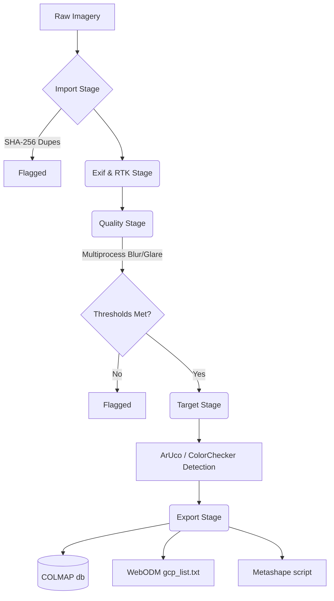

<div align="center">
  
# 🚁 OpticTriage

**Automated Diagnostic & Pre-Processing Pipeline for Drone Photogrammetry**

[](https://pypi.org/project/optictriage/)
[](https://www.python.org/downloads/)
[](https://opensource.org/licenses/MIT)
[](https://github.com/mabo-du/optictriage/actions)

</div>

OpticTriage is a lightweight, non-destructive diagnostic utility designed to pre-process large batches of field photographs (e.g., from drone surveys) before they enter computationally expensive Structure-from-Motion (SfM) pipelines like COLMAP, WebODM, or Agisoft Metashape. It automatically detects blurs, glare, overexposure, and duplicates, while standardizing EXIF telemetry and detecting physical targets.

---

## ⚡ Architecture Pipeline



## 🚀 Installation

### Standalone Executables
No Python required! Download the pre-compiled, standalone executable for your operating system from the **[GitHub Releases](https://github.com/mabo-du/optictriage/releases)** page. 

### Python Package (PyPI)
For integration into your existing environment, install via pip:
```bash
pip install optictriage
```

> [!TIP]
> We recommend using `uv` for lightning-fast virtual environment scaffolding: `uv pip install optictriage`.

## 🛠️ Features at a Glance

| Feature | Description |
|---------|-------------|
| 🔍 **Quality Screening** | Automatically flags blurry, glary, or overexposed imagery using adjustable OpenCV thresholds. |
| ⏱️ **Hover-Duplicate Detection** | Uses perceptual hashing (dhash) to identify sequential near-duplicates caused by hovering drones. |
| 🎨 **Color Normalization** | Automatically detects cv2.mcc ColorCheckers and computes CIE 2000 ΔE normalizations non-destructively. |
| 🎯 **Target Subpixel Extraction** | Detects ArUco and ChArUco targets and refines corner coordinates to subpixel precision. |
| 📤 **Zero-Friction SfM Export** | Directly exports seeded `database.db` for COLMAP, GCP manifests for ODM, and automation scripts for Agisoft Metashape. |
| 🚀 **Multiprocessing Engine** | CPU-bound tasks dynamically scale across all available cores while strictly respecting RAM overhead limits. |

## 💻 Hardware Guidance

OpticTriage will seamlessly leverage a multi-core CPU pool for intensive I/O operations and image decoding. If an NVIDIA CUDA environment is detected by OpenCV, it will engage the GPU for CLAHE and bilateral filtering.

> [!WARNING]
> The initial CUDA call will reserve approximately 100MB of VRAM context. Ensure you terminate OpticTriage before launching VRAM-intensive downstream photogrammetry software.

| Requirement | Minimum | Recommended |
|-------------|---------|-------------|
| **CPU** | Intel Core i7 / AMD Ryzen 7 | Intel Core i9 / AMD Ryzen 9 |
| **RAM** | 32 GB | 64 GB |
| **GPU** | Nvidia RTX 3060 | Nvidia RTX 4080 (150W+ TGP) |
| **Storage** | 1TB NVMe Gen3 | 2TB NVMe Gen4 |

## 📖 Documentation
Please refer to the [User Guide](USER_GUIDE.md) for detailed workflow instructions, threshold configuration, and SfM integration steps.
