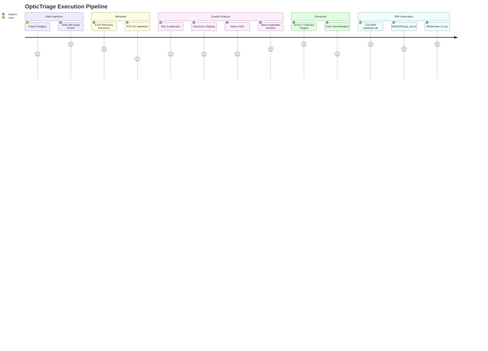

# 📖 OpticTriage User Guide

Welcome to the comprehensive guide for OpticTriage. This document will walk you through the end-to-end workflow of diagnosing and pre-processing drone survey datasets.

---

## 🎯 1. The Core Philosophy

Photogrammetry solvers (SfM pipelines) like Agisoft Metashape or COLMAP blindly attempt to match keypoints across all provided images. If you feed the solver poor-quality images—such as frames taken while the drone was pivoting quickly (blur), facing the sun (glare), or hovering in place (duplicates)—the solver wastes massive amounts of compute time attempting to optimize bad data, and often generates distorted point clouds.

OpticTriage solves this by acting as a **diagnostic gatekeeper**. 

## 🗺️ 2. The Five-Stage Workflow

### Stage 1: Import
Select your raw image directory and your desired output destination folder. During ingestion, OpticTriage chunks and evaluates the SHA-256 signature of every file. True duplicates are immediately ignored.

### Stage 2: Metadata & Exif
OpticTriage utilizes `pyexiv2` and ExifTool to rapidly parse DJI/Autel XMP payloads. 

> [!WARNING]
> **RTK Users:** OpticTriage actively scans the `rtk_flag` parameter. Images captured when the drone temporarily lost its RTK Fixed state (falling back to Float or Single Point) will be heavily penalized.

### Stage 3: Quality Thresholding
Adjust your thresholds in the UI to fit the specific needs of your survey:
- **Blur Variance:** OpticTriage slices the image into a grid, calculating the Laplacian variance of the sharpest 5% of tiles. A higher threshold demands sharper images.
- **Exposure:** Evaluates shadow and highlight clipping. Extreme clipping (e.g., shooting directly into the sun or deep shadow) will trigger a flag.
- **Glare:** Converts the image to true HSI space to evaluate veiling glare.
- **Hover Duplicates:** Calculates the Hamming distance between sequential frames using `imagehash.dhash`. Hovering drones taking sequential identical shots will have the redundant frames flagged.

### Stage 4: Target Detection
If physical Ground Control Points (GCPs) were laid out during the survey (ArUco or ChArUco targets), OpticTriage runs a heavily optimized CV pipeline to find them.

> [!TIP]
> Target detection utilizes `CLAHE` equalization and `Bilateral Filtering` to heavily reduce sensor noise before detecting target corners to subpixel (`cornerSubPix`) precision. If a CUDA-enabled NVIDIA GPU is detected, this operation is automatically offloaded to the GPU!

### Stage 5: Exporting & Integrations

Once analysis is complete, your chosen export directory will contain a master `optictriage_manifest.csv` and specific sub-folders for your preferred SfM platforms.

<strong>👉 COLMAP Integration</strong>

OpticTriage bypasses the standard COLMAP `feature_extractor` bottleneck by building the `colmap/database.db` file from scratch. It seeds the database with an exact 64-byte OPENCV camera payload and injects EXIF prior focal lengths. You can open COLMAP, select this database, and immediately begin feature extraction.

<strong>👉 WebODM Integration</strong>

If physical GCP markers were detected, an `odm/gcp_list.txt` file is formatted entirely to the OpenDroneMap standard. This file maps your physical marker ID directly to its subpixel XY coordinate within the image, ready for immediate upload via WebODM's GUI.

<strong>👉 Agisoft Metashape Integration</strong>

Inside the `metashape/` directory, you will find an auto-generated Python script (`run_metashape.py`). 
1. Open Agisoft Metashape.
2. Navigate to `Tools -> Run Script`.
3. Select `run_metashape.py`.

The script will programmatically create a chunk, import all passed photos, set the coordinate system (WGS84), and bind any detected markers automatically.

---

## 📈 Troubleshooting

**Q: I'm running out of memory during a large batch process!**
OpticTriage utilizes a dynamic memory guard. It actively monitors your total system RAM. However, if other applications (like Chrome) rapidly consume RAM while a worker pool is active, you may hit a swapping bottleneck. Close other memory-intensive applications before executing large drone surveys.

**Q: My CUDA GPU isn't being used.**
OpticTriage queries OpenCV to check for CUDA bindings. If you installed the default PyPI `opencv-python`, CUDA is not included. You must compile OpenCV from source with CUDA enabled, or use an environment that provides `opencv-python-cuda` binaries. (The standalone Windows Executable ships with CUDA bindings baked in).
